# MySQL 805 - Bate-papo com o Mestre

No dia 25/05/2026, tivemos um bate-papo com o mestre da 4Linux. Durante a aula, surgiram diversas dúvidas dos alunos, entre elas:

-   Qual é o backup mais comum em ambientes de produção com MySQL;
    
-   Uso do XtraBackup;
    
-   MyDumper/MyLoader e os erros mais comuns em processos de migração;
    
-   Como utilizar o MySQL InnoDB Cluster com VIP utilizando Keepalived;
    
-   Avaliação do MySQL HeatWave na OCI;
    
-   Como utilizar o MySQL Router e a possibilidade de uso com replicação simples;
    
-   Diferenças entre as distribuições do MySQL (Oracle, Percona e MariaDB) e as ferramentas de monitoramento e análise de logs da Percona.
    
A seguir, vamos abordar cada um desses temas.

# Qual é o backup mais comum em produção com MySQL?

Em termos de **backup físico**, a ferramenta mais utilizada em ambientes de produção é o **Percona XtraBackup**. Trata-se de uma solução **open source**, amplamente adotada pela comunidade e por empresas que utilizam MySQL em ambientes críticos.

O XtraBackup permite a realização de backups consistentes sem a necessidade de interromper o serviço do banco de dados, reduzindo o impacto nas aplicações durante o processo. Além disso, oferece suporte a **backups completos**, **incrementais** e **restaurações ponto a ponto**, tornando-se uma excelente opção para estratégias de recuperação de desastres.

Mas como utilizamos essa ferramenta na prática?

Na apostila do curso, o processo de instalação e configuração do XtraBackup está detalhado nas páginas **190 a 195**.

## Instalação

**Debian/Ubuntu:**

```bash
wget https://repo.percona.com/apt/percona-release_latest.generic_all.deb
dpkg -i percona-release_latest.generic_all.deb
apt-get update
percona-release enable pxb-84-lts
apt-get install -y percona-xtrabackup-84
```

**RHEL/Rocky/Alma/CentOS:**

```bash
yum install -y https://repo.percona.com/yum/percona-release-latest.noarch.rpm
percona-release enable pxb-84-lts
yum install -y percona-xtrabackup-84
```

### Usuário e credenciais

```sql
CREATE USER xtrabackup@localhost IDENTIFIED BY 'aluno123';

GRANT BACKUP_ADMIN, PROCESS, RELOAD, LOCK TABLES, REPLICATION CLIENT
ON *.* TO xtrabackup@localhost;

GRANT SELECT ON performance_schema.log_status TO xtrabackup@localhost;
GRANT SELECT ON performance_schema.keyring_component_status TO xtrabackup@localhost;
GRANT SELECT ON performance_schema.replication_group_members TO xtrabackup@localhost;
```

```bash
# Armazena a senha de forma criptografada (evita expor na linha de comando)
mysql_config_editor set --host=localhost --user='xtrabackup' --password --login-path=xtrabackup
```

### Backup Full

```bash
mkdir -p /srv/bkps/full

xtrabackup --login-path=xtrabackup --backup --target-dir=/srv/bkps/full
```

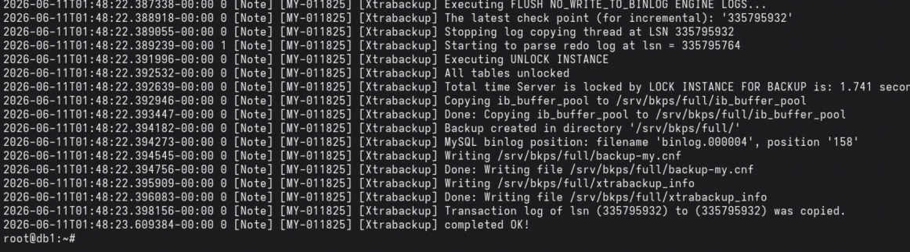

```bash
ls -lh /srv/bkps/full
```

### Backup Incremental

```bash
# Limpa backups anteriores e faz o full (base)
rm -rf /srv/bkps/full/*
xtrabackup --login-path=xtrabackup --backup --target-dir=/srv/bkps/full

# Incremental 1: captura apenas o que mudou desde o full
xtrabackup --login-path=xtrabackup --backup --target-dir=/srv/bkps/inc1 --incremental-basedir=/srv/bkps/full

# Incremental 2: captura apenas o que mudou desde o inc1
xtrabackup --login-path=xtrabackup --backup --target-dir=/srv/bkps/inc2 --incremental-basedir=/srv/bkps/inc1
```

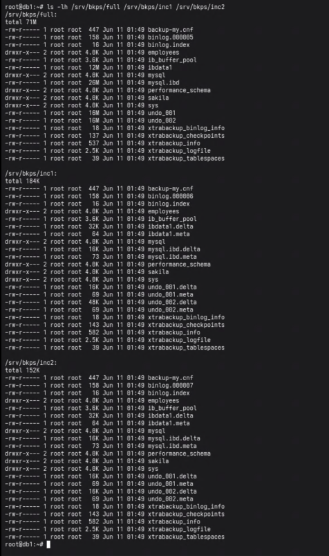

```bash
ls -lh /srv/bkps/full /srv/bkps/inc1 /srv/bkps/inc2
```

### Backup Diferencial

> O XtraBackup não tem um modo "diferencial" próprio: na prática, um
> diferencial é um incremental tirado **sempre a partir do full** (em vez de
> encadear sobre o incremental anterior).

```bash
# Diferencial 1: tudo que mudou desde o full
xtrabackup --login-path=xtrabackup --backup --target-dir=/srv/bkps/diff1 --incremental-basedir=/srv/bkps/full

# Diferencial 2: tudo que mudou desde o full (não a partir do diff1)
xtrabackup --login-path=xtrabackup --backup --target-dir=/srv/bkps/diff2 --incremental-basedir=/srv/bkps/full
```

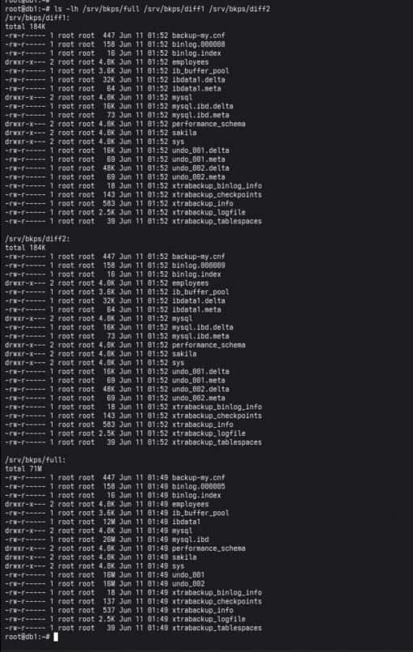

```bash
ls -lh /srv/bkps/full /srv/bkps/diff1 /srv/bkps/diff2
```

### Restore

```bash
# Restore simples (apenas backup full)
xtrabackup --prepare --target-dir=/srv/bkps/full

systemctl stop mysql
rm -rf /var/lib/mysql/*
xtrabackup --copy-back --target-dir=/srv/bkps/full --datadir=/var/lib/mysql
chown -R mysql: /var/lib/mysql
systemctl start mysql
```

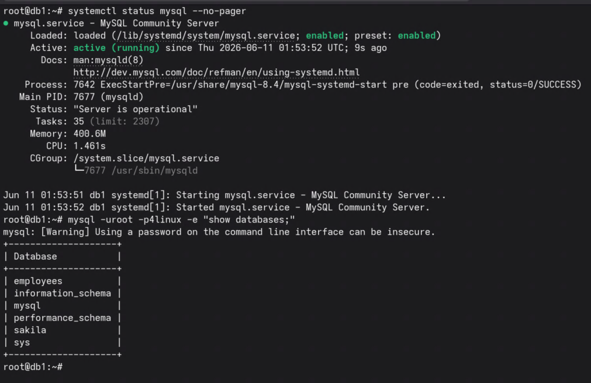

```bash
systemctl status mysql --no-pager
mysql -uroot -p4linux -e "show databases;"
```

```bash
# Restore com incrementais (full + inc1 + inc2)
xtrabackup --prepare --apply-log-only --target-dir=/srv/bkps/full
xtrabackup --prepare --apply-log-only --target-dir=/srv/bkps/full --incremental-dir=/srv/bkps/inc1
xtrabackup --prepare --apply-log-only --target-dir=/srv/bkps/full --incremental-dir=/srv/bkps/inc2

# Última preparação SEM --apply-log-only (faz o rollback de transações não commitadas)
xtrabackup --prepare --target-dir=/srv/bkps/full

systemctl stop mysql
rm -rf /var/lib/mysql/*
xtrabackup --copy-back --target-dir=/srv/bkps/full --datadir=/var/lib/mysql
chown -R mysql: /var/lib/mysql
systemctl start mysql
```

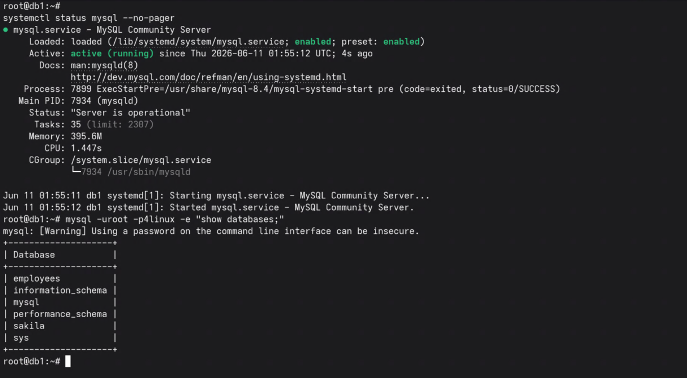

```bash
systemctl status mysql --no-pager
mysql -uroot -p4linux -e "show databases;"
```

```bash
# Restore com diferencial (full + diff mais recente, ex.: diff2)
xtrabackup --prepare --apply-log-only --target-dir=/srv/bkps/full
xtrabackup --prepare --target-dir=/srv/bkps/full --incremental-dir=/srv/bkps/diff2

systemctl stop mysql
rm -rf /var/lib/mysql/*
xtrabackup --copy-back --target-dir=/srv/bkps/full --datadir=/var/lib/mysql
chown -R mysql: /var/lib/mysql
systemctl start mysql
```

```bash
systemctl status mysql --no-pager
mysql -uroot -p4linux -e "show databases;"
```
# MyDumper/MyLoader

O **MyDumper** e o **MyLoader** são ferramentas open source utilizadas para realizar **backups lógicos** e **restaurações** de bancos de dados MySQL e compatíveis.

O projeto surgiu como uma alternativa ao tradicional **mysqldump**, que opera de forma single-thread. Já o MyDumper utiliza múltiplas threads para exportar os dados em paralelo, reduzindo significativamente o tempo necessário para backup e restauração em ambientes de grande porte. Mais detalhes na [documentação oficial do MyDumper](https://mydumper.github.io/mydumper/docs/html/index.html).

O projeto é composto por duas ferramentas principais:

-   **mydumper**: responsável por exportar os bancos de dados de forma consistente;
    
-   **myloader**: responsável por importar os arquivos gerados pelo MyDumper para um servidor de destino.

Entre as principais vantagens do MyDumper/MyLoader estão:

-   Execução paralela utilizando múltiplas threads;
    
-   Maior velocidade de backup e restauração;
    
-   Arquivos organizados por banco e tabela, facilitando a administração;
    
-   Manutenção da consistência dos dados durante o backup;
    
-   Suporte a filtros para inclusão e exclusão de bancos e tabelas.

## Instalação

**Debian/Ubuntu:**

```bash
# Adicionar chave GPG do repositório
wget -qO- 'https://keyserver.ubuntu.com/pks/lookup?op=get&search=0x1D357EA7D10C9320371BDD0279EA15C0E82E34BA&exact=on' | sudo tee /etc/apt/keyrings/mydumper.asc

# Adicionar repositório do MyDumper
echo "deb [signed-by=/etc/apt/keyrings/mydumper.asc] https://mydumper.github.io/mydumper/repo/apt/debian $(lsb_release -cs) main" | sudo tee /etc/apt/sources.list.d/mydumper.list

# Instalar MyDumper e MyLoader
apt-get update && apt-get install mydumper
```

**RHEL/Rocky/Alma/CentOS:**

```bash
# Baixa o pacote .rpm da release desejada (ajustar versão/arquitetura conforme necessário)
wget https://github.com/mydumper/mydumper/releases/download/v0.16.7-5/mydumper-0.16.7-5.el9.x86_64.rpm

# Instala (resolve dependências automaticamente)
dnf install -y ./mydumper-0.16.7-5.el9.x86_64.rpm
```

### Configuração de Usuário

```sql
-- Criar usuário específico para backup com permissões necessárias
CREATE USER 'mydumper'@'%' IDENTIFIED BY 'aluno123';

-- Permissões mínimas requeridas:
-- SELECT: ler dados
-- LOCK TABLES: garantir consistência
-- SHOW VIEW: backup de views
-- EVENT: backup de eventos
-- TRIGGER: backup de triggers
-- REPLICATION CLIENT: informações de binlog
-- BACKUP_ADMIN: operações de backup (MySQL 8.0+)
-- RELOAD: flush tables
GRANT SELECT, LOCK TABLES, SHOW VIEW, EVENT, TRIGGER, REPLICATION CLIENT, BACKUP_ADMIN, RELOAD 
ON *.* TO 'mydumper'@'%';
```

### Backup com MyDumper

```bash
# Backup single-thread (padrão)
# -B: especifica database
# -o: diretório de saída
mydumper -u mydumper -p aluno123 -h localhost -P 3306 -B employees -o /tmp/employees

# Ver arquivos criados
cd /tmp/employees/

# Backup paralelo com 2 threads
# --threads: número de conexões paralelas (acelera o backup)
# Cada thread processa tabelas diferentes simultaneamente
mydumper -u mydumper -p aluno123 -h localhost -P 3306 -B employees --threads=2 -o /tmp/employees
```

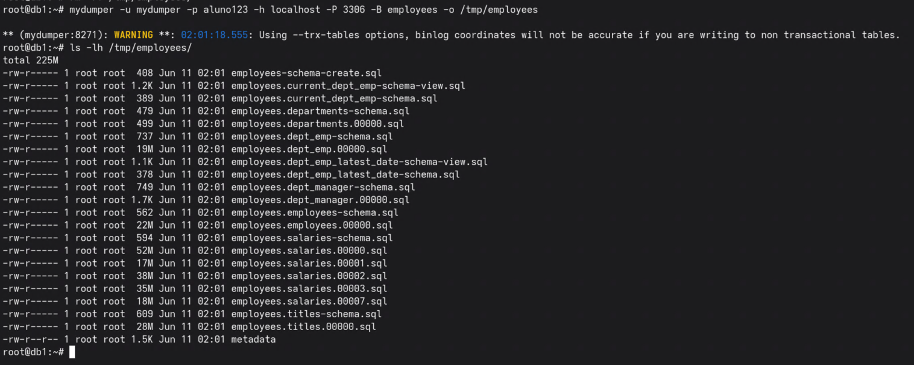

```bash
ls -lh /tmp/employees/
```

### Restore com MyLoader

```bash
# Preparar para restore
DROP DATABASE employees;
SET GLOBAL FOREIGN_KEY_CHECKS = 0;

# Restaurar com MyLoader
# -d: diretório com backup
# --threads: paralelização do restore
# --verbose 3: log detalhado (níveis: 1=info, 2=debug, 3=trace)
myloader -u root -p aluno123 -h localhost -P 3306 -d /tmp/employees/ --threads 2 --verbose 3
```

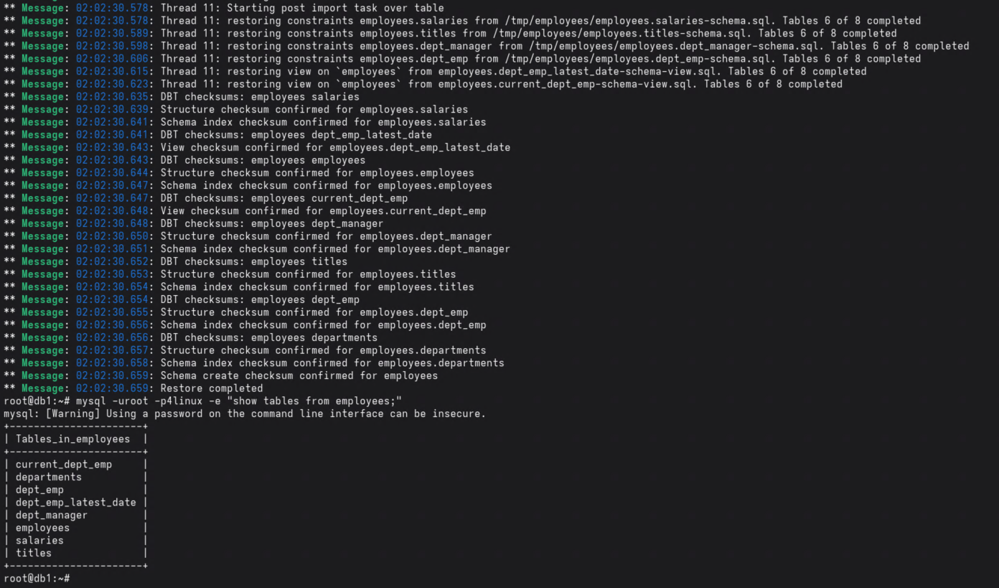

```bash
mysql -uroot -p4linux -e "show tables from employees;"
```

# Como utilizar o MySQL InnoDB Cluster com VIP (Keepalived)

O **InnoDB Cluster** (Group Replication) garante alta disponibilidade e
failover automático entre os 3 nós, mas a aplicação ainda precisa de um
ponto de entrada único e estável. É aí que entram o **MySQL Router**
(roteia para o nó PRIMARY/SECONDARY corretos) e o **Keepalived** (mantém o
IP virtual, o VIP, sempre apontando para um nó com Router ativo).

## Preparando os 3 nós (db1, db2, db3)

Em cada um dos 3 nós, configurar a instância para o Group Replication e criar
o usuário administrador do cluster (`cadmin`):

```bash
mysqlsh --uri root:4linux@localhost:3306 --js -e "
dba.configureInstance('root:4linux@localhost:3306', {
  clusterAdmin: 'cadmin',
  clusterAdminPassword: '4linux',
  restart: true
});"
```

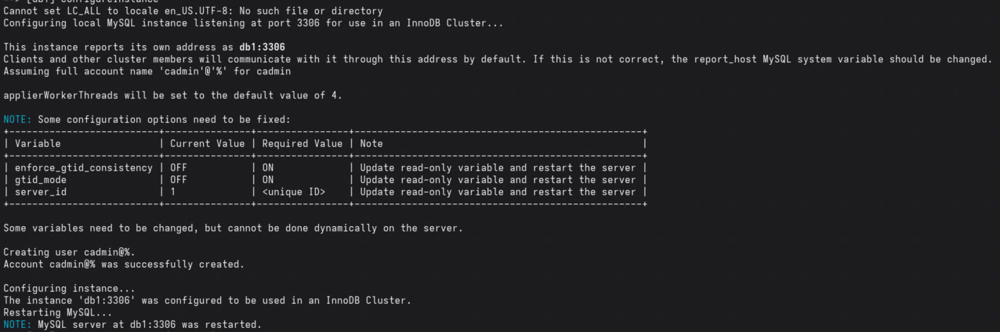

## Criando o cluster (em db1)

```bash
mysqlsh --uri cadmin:4linux@localhost:3306 --js -e "
var cluster = dba.createCluster('cluster_curso', {gtidSetIsComplete: true});
print(cluster.status());"
```

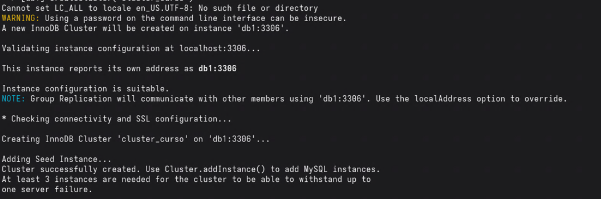

## Adicionando db2 e db3 ao cluster (em db1)

```bash
mysqlsh --uri cadmin:4linux@localhost:3306 --js -e "
var cluster = dba.getCluster();
cluster.addInstance('cadmin:4linux@db2:3306', {recoveryMethod: 'clone'});"

mysqlsh --uri cadmin:4linux@localhost:3306 --js -e "
var cluster = dba.getCluster();
cluster.addInstance('cadmin:4linux@db3:3306', {recoveryMethod: 'clone'});"
```

## Conferindo o status do cluster

```bash
mysqlsh --uri cadmin:4linux@localhost:3306 --js -e "print(dba.getCluster().status());"
```

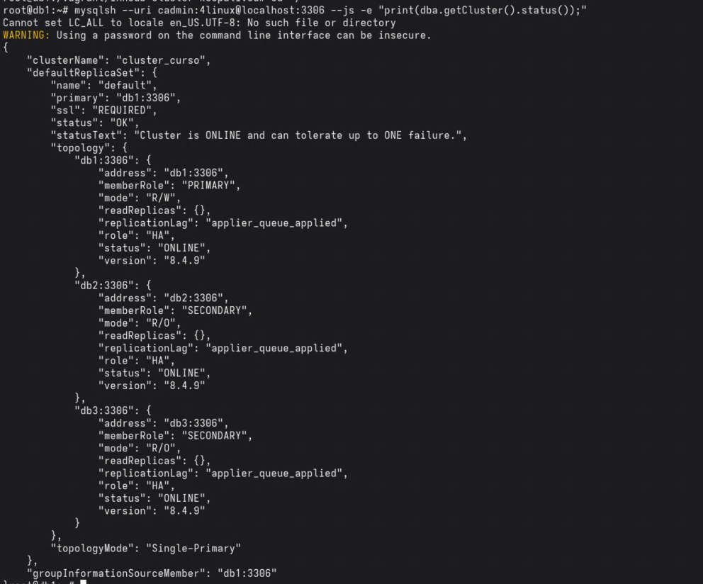

## Bootstrap do MySQL Router (em cada um dos 3 nós)

```bash
systemctl stop mysqlrouter || true
mysqlrouter --bootstrap cadmin:4linux@db1:3306 --user=mysqlrouter --force --conf-use-gr-notifications
systemctl restart mysqlrouter
systemctl enable mysqlrouter
```

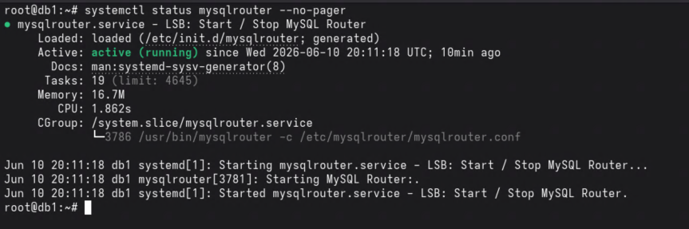

```bash
systemctl status mysqlrouter --no-pager
```

## Keepalived - VIP 172.27.11.100

### O que é o Keepalived?

O **Keepalived** é um serviço que implementa o protocolo **VRRP** (Virtual
Router Redundancy Protocol) para fornecer alta disponibilidade de IP entre
vários servidores. Ele faz com que um **IP virtual (VIP)**, um endereço que
não pertence fisicamente a nenhum nó, fique sempre ativo em **um** dos nós
do grupo.

Os nós trocam mensagens periódicas entre si (`advert_int`) para saber quem
está vivo. Cada nó tem uma `priority`: o de maior prioridade que estiver
saudável assume o papel de **MASTER** e ativa o VIP na sua interface de rede;
os demais ficam em **BACKUP**, monitorando. Se o MASTER cair (ou o serviço
parar), o BACKUP de maior prioridade assume o VIP automaticamente, em
segundos.

No nosso cenário, o VIP `172.27.11.100` é o ponto de entrada único para a
aplicação se conectar ao MySQL Router. Como o Router está rodando em todos os
nós (db1, db2, db3), basta o Keepalived garantir que o VIP sempre esteja
ativo em algum nó com Router funcionando, mesmo que o nó MySQL PRIMARY do
cluster mude, a aplicação continua falando com o mesmo IP.

Nós: db1 = 172.27.11.10, db2 = 172.27.11.20, db3 = 172.27.11.30 (mesmos IPs
das VMs do cluster).

Em `/etc/keepalived/keepalived.conf`, ajustando `state`, `priority`,
`unicast_src_ip` e `unicast_peer` por nó (db1 = MASTER/101, db2 =
BACKUP/100, db3 = BACKUP/99). `unicast_peer` lista os outros 2 nós, evitando
depender de multicast, que nem sempre funciona em redes host-only/VirtualBox.

**db1:**

```conf
vrrp_instance VI_INNODB_CLUSTER {
    state MASTER
    interface eth1
    virtual_router_id 51
    priority 101
    advert_int 1
    unicast_src_ip 172.27.11.10
    unicast_peer {
        172.27.11.20
        172.27.11.30
    }
    authentication {
        auth_type PASS
        auth_pass 4linux
    }
    virtual_ipaddress {
        172.27.11.100
    }
}
```

**db2** (priority 100, `unicast_src_ip 172.27.11.20`, `unicast_peer { 172.27.11.10 172.27.11.30 }`)

**db3** (priority 99, `unicast_src_ip 172.27.11.30`, `unicast_peer { 172.27.11.10 172.27.11.20 }`)

Em todos os nós: `state BACKUP` também funciona para o MASTER inicial (o
Keepalived elege o MASTER pela `priority`); ajuste conforme preferir.

```bash
systemctl enable keepalived
systemctl restart keepalived
```

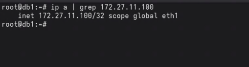

## Simulando falha do nó PRIMARY (failover do cluster + da VIP)

```bash
# Em db1: derruba o MySQL
systemctl stop mysql
```

```bash
# Em db2: verifica quem assumiu como novo PRIMARY
mysqlsh --uri cadmin:4linux@localhost:3306 --js -e "print(dba.getCluster().status());"
```

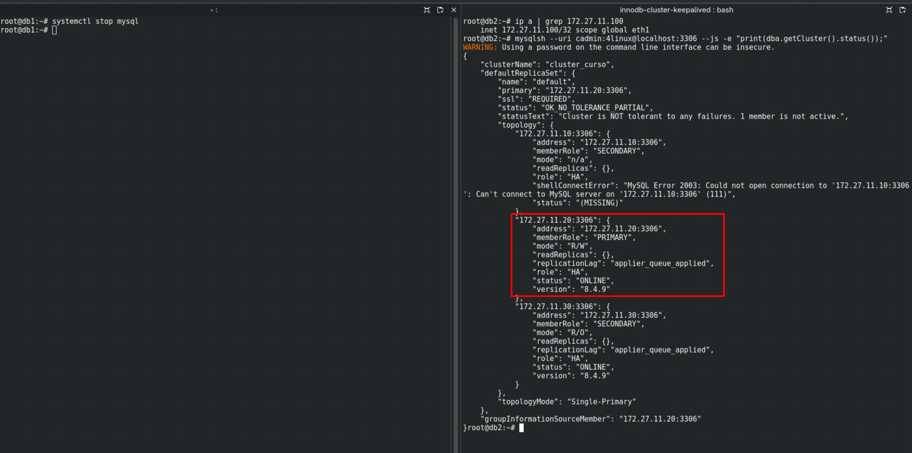

```bash
# Em db2/db3: confere para onde a VIP migrou
ip a | grep 172.27.11.100
```

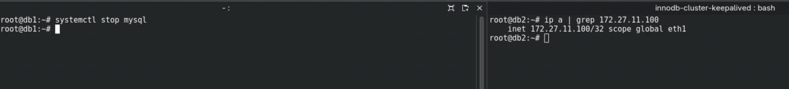


# MySQL Router

O MySQL Router atua como proxy inteligente entre a aplicação e o cluster.

## MySQL Classic protocol

- **Read/Write Connections**: localhost:6446 -> sempre roteia para o nó **PRIMARY**;
- **Read/Only Connections**: localhost:6447 -> round-robin entre os nós **SECONDARY**;
- **Read/Write Split Connections**: localhost:6450 -> uma única conexão que
  roteia automaticamente cada statement para PRIMARY (escritas) ou SECONDARY
  (leituras), sem a aplicação precisar abrir conexões separadas.

No ambiente do InnoDB Cluster (seção acima), o Router já fica configurado em
todos os nós após o `build-cluster.sh`. Teste:

```bash
# Escrita -> sempre o PRIMARY atual (via VIP do Keepalived)
mysql -ucadmin -p4linux -h 172.27.11.100 -P 6446 -e "select @@hostname"

# Leitura -> round-robin entre SECONDARY
mysql -ucadmin -p4linux -h 172.27.11.100 -P 6447 -e "select @@hostname"
```

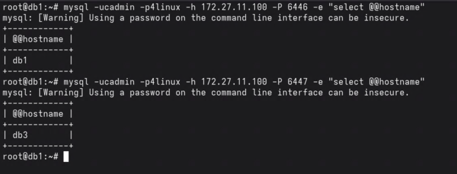

## Router com replicação normal (clássica, sem AdminAPI)?

Sim, funciona, mas de forma **estática**. O `mysqlrouter --bootstrap`
automático só funciona com InnoDB Cluster/ReplicaSet/ClusterSet, porque ele
depende do schema de metadata criado pela AdminAPI do MySQL Shell. Numa
replicação clássica (binlog + posição, sem GTID, sem AdminAPI) esse schema
não existe, então o Router é configurado manualmente, com destinos fixos:

- 6446 (R/W) -> sempre `db1` (source)
- 6447 (R/O) -> sempre `db2` (replica)

Em db1, criar os usuários `repl` (replicação) e `app` (acesso via Router):

```bash
mysql -uroot -p4linux <<SQL
CREATE USER IF NOT EXISTS 'repl'@'%' IDENTIFIED BY '4linux';
GRANT REPLICATION SLAVE ON *.* TO 'repl'@'%';

CREATE USER IF NOT EXISTS 'app'@'%' IDENTIFIED BY '4linux';
GRANT ALL PRIVILEGES ON *.* TO 'app'@'%';
FLUSH PRIVILEGES;
SQL
```

Em db1, gerar um dump consistente já com a posição do binlog
(`--source-data=2`), copiar para db2 e restaurar:

```bash
mysqldump -uroot -p4linux --all-databases --source-data=2 \
  --single-transaction --triggers --routines > /tmp/dump.sql

scp /tmp/dump.sql root@db2:/tmp/dump.sql
ssh root@db2 "mysql -uroot -p4linux < /tmp/dump.sql"
```

O dump traz uma linha comentada `-- CHANGE MASTER TO MASTER_LOG_FILE='...',
MASTER_LOG_POS=...;` (ou `CHANGE REPLICATION SOURCE TO ...`) com o ponto
exato do binlog no momento do dump.

Em db2, apontar para db1 usando esse arquivo/posição e iniciar a replicação:

```bash
mysql -uroot -p4linux <<SQL
CHANGE REPLICATION SOURCE TO
  SOURCE_HOST='db1',
  SOURCE_USER='repl',
  SOURCE_PASSWORD='4linux',
  SOURCE_LOG_FILE='mysql-bin.000001',
  SOURCE_LOG_POS=157,
  GET_SOURCE_PUBLIC_KEY=1;
START REPLICA;
SQL

mysql -uroot -p4linux -e "SHOW REPLICA STATUS\G"
```

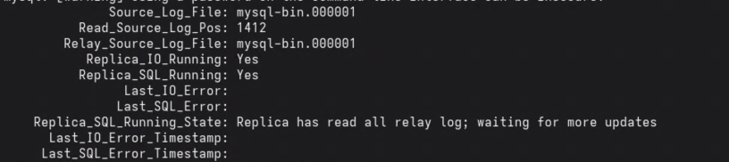

Em db1, configurar o MySQL Router manualmente (modo estático, sem bootstrap):

```bash
cat > /etc/mysqlrouter/mysqlrouter.conf <<EOF
[DEFAULT]
user=mysqlrouter
logging_folder=/var/log/mysqlrouter
runtime_folder=/run/mysqlrouter
data_folder=/var/lib/mysqlrouter

[routing:classic_rw]
bind_address=0.0.0.0
bind_port=6446
destinations=db1:3306
routing_strategy=first-available
protocol=classic

[routing:classic_ro]
bind_address=0.0.0.0
bind_port=6447
destinations=db2:3306
routing_strategy=first-available
protocol=classic
EOF

systemctl restart mysqlrouter
systemctl enable mysqlrouter
```

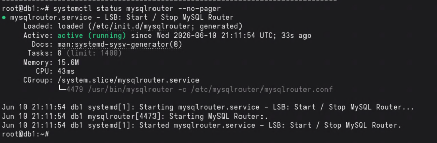

```bash
# R/W -> sempre db1 (source)
mysql -uapp -p4linux -h db1 -P 6446 -e "select @@hostname, @@read_only"

# R/O -> sempre db2 (replica)
mysql -uapp -p4linux -h db1 -P 6447 -e "select @@hostname, @@read_only"
```

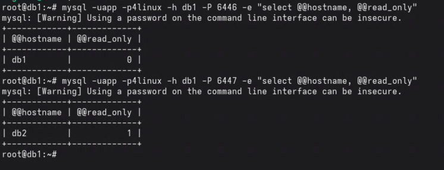

Insira dados pela porta 6446 e confirme que aparecem ao consultar pela 6447
(replicação assíncrona, pode haver um pequeno delay):

```bash
mysql -uapp -p4linux -h db1 -P 6446 -e "create database if not exists teste; create table if not exists teste.t1 (id int primary key, nome varchar(50)); insert into teste.t1 values (1, 'replica ok');"

mysql -uapp -p4linux -h db1 -P 6447 -e "select * from teste.t1;"
```

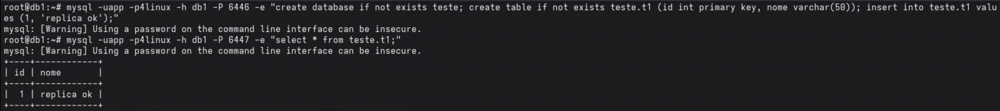

**Diferença principal para o InnoDB Cluster/ReplicaSet**: aqui o Router só
faz proxy estático para destinos fixos. Não há detecção de topologia nem
failover automático: se db1 cair, é preciso promover db2 manualmente e
editar `destinations=` em `mysqlrouter.conf` na mão.


# MySQL HeatWave

O **MySQL HeatWave** é um serviço de banco de dados totalmente gerenciado da Oracle que reúne, em uma única plataforma, processamento transacional (**OLTP**), processamento analítico (**OLAP**) e recursos de **Machine Learning**.

Na prática, isso significa que a mesma base de dados utilizada pelas aplicações pode ser usada para executar consultas analíticas complexas e modelos de inteligência artificial, sem a necessidade de exportar dados para soluções externas de análise ou _data warehouses_.

O grande diferencial do HeatWave está em sua arquitetura baseada em processamento **in-memory** e armazenamento **colunar**, permitindo que consultas analíticas sejam executadas com desempenho significativamente superior ao de um ambiente MySQL tradicional.

Segundo a Oracle, determinadas cargas analíticas podem apresentar ganhos de desempenho de até **5.400 vezes** quando comparadas à execução direta no mecanismo transacional do MySQL. Além disso, a solução elimina a necessidade de manter cópias dos dados em plataformas distintas, reduzindo custos operacionais e simplificando a arquitetura.

A ativação do HeatWave é feita através da adição de um **HeatWave Cluster** ao serviço **MySQL Database Service**, permitindo que operações transacionais e analíticas coexistam no mesmo ambiente.

Atualmente, o serviço está disponível na **Oracle Cloud Infrastructure (OCI)**, **Amazon Web Services (AWS)** e **Microsoft Azure**.

Em resumo, o MySQL HeatWave pode ser visto como uma evolução do MySQL tradicional, capaz de executar cargas transacionais, análises de dados em larga escala e tarefas de inteligência artificial utilizando a mesma base de dados, com alto desempenho e menor complexidade operacional.

> **Importante:** O MySQL HeatWave é uma solução comercial da Oracle e não faz parte do ecossistema open source do MySQL Community Edition. Como o foco do curso é o MySQL Open Source e suas principais ferramentas livres, o HeatWave não é abordado em profundidade durante as aulas.

## Documentação Oficial

### Oracle Cloud Infrastructure (OCI)

[https://docs.public.content.oci.oraclecloud.com/pt-br/iaas/mysql-database/home.htm](https://docs.public.content.oci.oraclecloud.com/pt-br/iaas/mysql-database/home.htm)

### Guia do Usuário do MySQL HeatWave

[https://dev.mysql.com/doc/heatwave/en/](https://dev.mysql.com/doc/heatwave/en/)

### Primeiros Passos com o HeatWave

[https://dev.mysql.com/doc/heatwave/en/heatwave-get-started.html](https://dev.mysql.com/doc/heatwave/en/heatwave-get-started.html)

### Recursos e Funcionalidades

[https://www.oracle.com/br/heatwave/features/](https://www.oracle.com/br/heatwave/features/)


# Diferenças entre as versões do MySQL (Percona, Oracle e MariaDB) e ferramentas de log da Percona.


## Oracle MySQL

O **Oracle MySQL** é a versão oficial do MySQL, mantida pela Oracle. Trata-se da distribuição mais amplamente utilizada no mercado, oferecendo estabilidade, ampla compatibilidade com aplicações e suporte oficial do fabricante.

A edição Community é distribuída gratuitamente e atende à maioria dos cenários. Já a edição Enterprise disponibiliza recursos adicionais, como **Thread Pool**, auditoria avançada, monitoramento aprimorado e ferramentas de segurança, mediante licenciamento comercial.

**Documentação oficial:**
[https://dev.mysql.com/doc/](https://dev.mysql.com/doc/)

## Percona Server for MySQL

O **Percona Server for MySQL** é um *fork* compatível (*drop-in replacement*) do Oracle MySQL, desenvolvido com foco em desempenho, observabilidade e recursos avançados para ambientes corporativos.

Uma das principais vantagens da distribuição da Percona é disponibilizar gratuitamente funcionalidades que, no Oracle MySQL, estão disponíveis apenas na edição Enterprise. Entre elas estão o **Thread Pool**, métricas avançadas do InnoDB, ferramentas adicionais de diagnóstico e monitoramento de desempenho.

Além disso, a Percona também mantém o **Percona XtraBackup**, uma das ferramentas de backup físico mais utilizadas em ambientes MySQL de produção.

**Documentação oficial:**
[https://docs.percona.com/percona-server/8.4/](https://docs.percona.com/percona-server/8.4/)

## MariaDB

O **MariaDB** surgiu como um *fork* do MySQL criado pelos desenvolvedores originais do projeto após a aquisição da Sun Microsystems pela Oracle.

Com o passar dos anos, o MariaDB evoluiu de forma independente e passou a incorporar recursos próprios, incluindo mecanismos de armazenamento como **Aria**, **ColumnStore** e **MyRocks**, além da integração nativa com o **Galera Cluster** para alta disponibilidade.

Embora mantenha compatibilidade com diversas aplicações desenvolvidas para MySQL, o MariaDB se distanciou significativamente da implementação original em aspectos relacionados à arquitetura interna, recursos exclusivos, replicação e gerenciamento de transações.

Por esse motivo, migrações entre MariaDB e MySQL devem ser cuidadosamente planejadas e testadas, especialmente quando envolvem recursos específicos de cada plataforma, replicação ou utilização de **GTIDs**.

**Documentação oficial:**
[https://mariadb.com/docs](https://mariadb.com/docs)


## Ferramentas de log do Percona Toolkit: `pt-query-digest`

O `pt-query-digest` analisa o **slow query log** (ou o general log, ou
`processlist`) e gera um relatório com as queries que mais consomem tempo,
agrupando por "fingerprint" (mesma query, valores diferentes).

### Instalação

**Debian/Ubuntu:**

```bash
wget https://repo.percona.com/apt/percona-release_latest.generic_all.deb
dpkg -i percona-release_latest.generic_all.deb
apt-get update
percona-release enable tools release
apt-get install -y percona-toolkit
```

**RHEL/Rocky/Alma/CentOS:**

```bash
yum install -y https://repo.percona.com/yum/percona-release-latest.noarch.rpm
percona-release enable tools release
yum install -y percona-toolkit
```

```bash
pt-query-digest --version
```

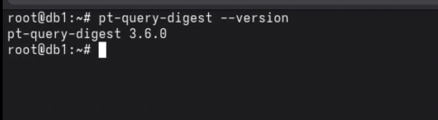

### Habilitando o slow query log

```sql
-- Ativa o slow query log
SET GLOBAL slow_query_log = 'ON';

-- Define o destino: tabela (mais fácil para o pt-query-digest) ou arquivo
SET GLOBAL log_output = 'FILE';
SET GLOBAL slow_query_log_file = '/var/log/mysql/slow.log';

-- Toda query que demorar mais que isso (em segundos) é registrada
SET GLOBAL long_query_time = 0.1;

-- (opcional) registra também queries sem usar índice
SET GLOBAL log_queries_not_using_indexes = 'ON';
```

```bash
# Garantir que o MySQL consegue escrever no arquivo
touch /var/log/mysql/slow.log
chown mysql:mysql /var/log/mysql/slow.log
```

```bash
mysql -uroot -p4linux -e "show variables like 'slow_query%'; show variables like 'long_query_time';"
```

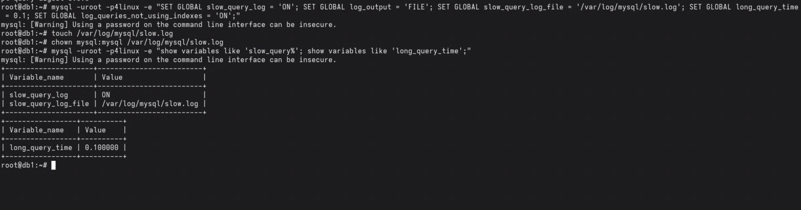

### Analisando com `pt-query-digest`

```bash
# Relatório geral (top queries por tempo total)
pt-query-digest /var/log/mysql/slow.log

# Salvando o relatório em arquivo
pt-query-digest /var/log/mysql/slow.log > /tmp/relatorio-slow.txt

# Filtrando por período
pt-query-digest --since '2026-06-10 00:00:00' --until '2026-06-10 23:59:59' /var/log/mysql/slow.log

# Analisando direto do processlist (sem precisar do slow log)
pt-query-digest --processlist h=localhost,u=root,p=4linux
```

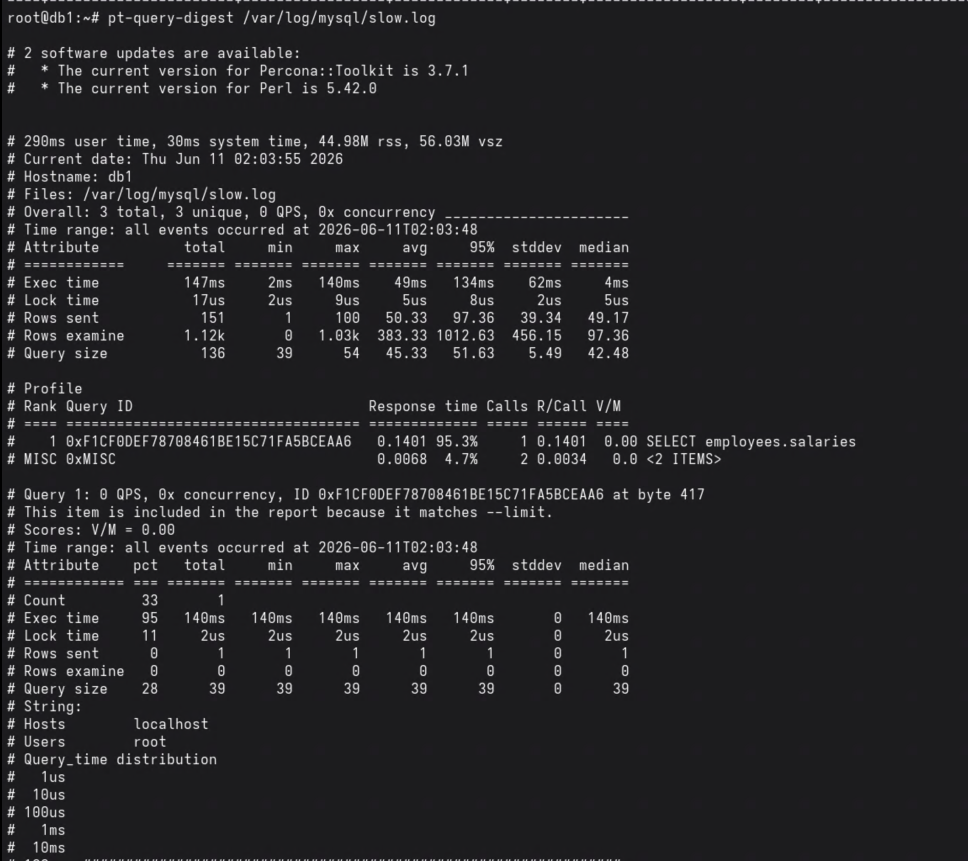

### Lendo o relatório

- **Query 1, 2, 3...**: rank por `Exec time` total (impacto agregado, não por
  execução individual);
- **Rank / Response time**: % do tempo total gasto naquele fingerprint;
- **Calls**: quantas vezes a query rodou;
- Bloco no final de cada query mostra `EXPLAIN` e a query "fingerprint" -
  útil para achar candidatos a índice.

> Não esquecer de voltar `long_query_time` para um valor razoável
> (ex.: `2`) depois do teste, para não sobrecarregar o disco com o slow log.
